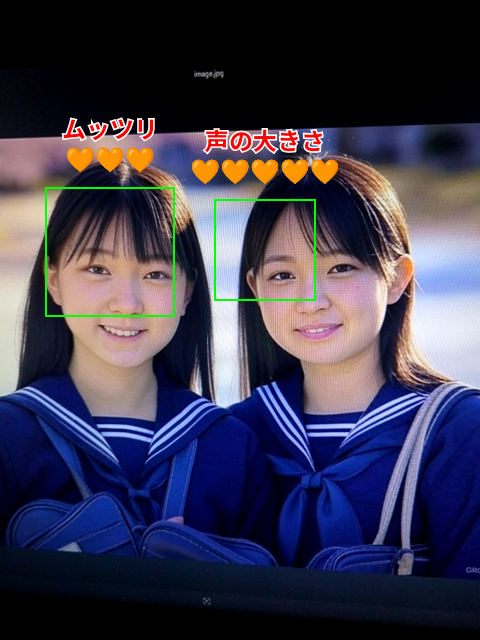

# 顔認識ステータス表示

このプロジェクトは、1 つの HTML ファイル（`index.html`）で実装された顔認識と画像／動画撮影機能を提供するデモです。  
Tracking.js を用いた顔検出と、MediaRecorder API を利用した動画録画機能を組み合わせ、レスポンシブにカメラ映像とオーバーレイを表示します。また、可愛いボタン（絵文字付き）で操作できるようにしており、利用可能なカメラが複数台ある場合は、フロントカメラとバックカメラを切り替える機能も提供します。

**※サンプル画像はGrokにて生成した画像を使用しています。**

## デモ

[デモ画面](https://c-a-p-engineer.github.io/FaceStatusDetector/)

## 機能

- **顔検出**  
  Tracking.js を使用し、カメラ映像内の顔を検出。検出結果に合わせて、顔枠およびランダムなラベル（2 種類のモード）をオーバーレイ表示します。
  - **colon モード**: 「SEXした回数」「イッた回数」「抜いた回数」「オカズにされた数」＋ 0～9999 の乱数
  - **heart モード**: 「毛の濃さ」「感度」「声の大きさ」「メスガキ」「ツンデレ」「ムッツリ」＋ 🧡（1～5 個の乱数）
  
- **画像撮影機能**  
  オーバーレイ付きのカメラ映像を、PNG 画像として撮影し、新しいウィンドウで表示できます。

- **動画撮影機能**  
  Canvas の内容を録画し、録画終了時に WebM 形式でダウンロード可能です。  
  ※ 録画中はボタンの表示や背景色が変化し、撮影中であることが一目でわかります。

- **カメラ切替機能**  
  利用可能なカメラが複数台ある場合、フロントカメラ（user）とバックカメラ（environment）を切り替えることができます。  
  ※ カメラが 1 台の場合は、切替機能は非表示となります。

- **レスポンシブ対応**  
  画面サイズに合わせてカメラ映像とオーバーレイのサイズが自動調整され、PC やスマホなど、さまざまなデバイスで利用可能です。

## 使用方法

1. このリポジトリをクローンまたはダウンロードします。
2. HTTPS 環境（ローカルサーバー、GitHub Pages など）で `index.html` をブラウザで開きます。
3. カメラへのアクセス許可を求められるので、許可してください。
4. 表示されたカメラ映像上に顔検出の結果（顔枠とラベル）がオーバーレイされます。
5. 下部の **📸 画像撮影** ボタンで静止画を、**🎥 動画撮影開始** ボタンで動画の録画を開始／停止できます。
6. 利用可能なカメラが複数台ある場合は、**🔄 カメラ切替** ボタンでカメラを切り替えることができます。

## 注意点

- カメラ映像および録画機能は HTTPS 環境でのみ動作します。

## ライセンス

このプロジェクトは MIT ライセンスの下で公開されています。  
詳細は [LICENSE](LICENSE) ファイルを参照してください.
